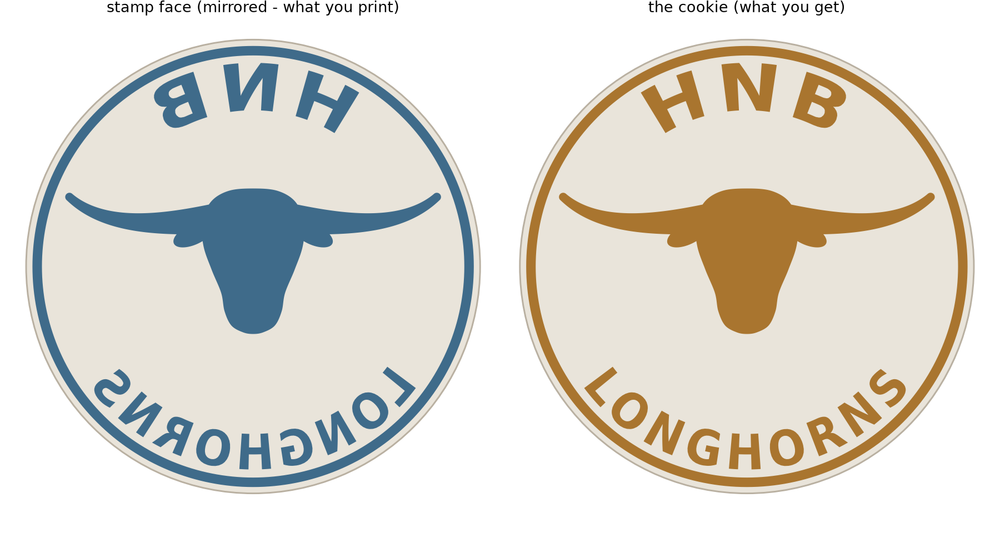

# HNB Longhorns — cookie cutter & stamp

A parametric 3D-printable cookie cutter set: a round cutter ring plus a drop-in
stamp that presses **HNB** across the top, a longhorn in the middle, and
**LONGHORNS** across the bottom.

The artwork on the stamp is **mirrored on purpose**. A stamp leaves a mirror
image of itself in the dough, so the letters have to be backwards on the tool
for the cookie to come out reading forwards. `preview/01_artwork.png` shows both
sides of that trade so you can confirm it before spending filament.



## What to print

| File | What it is | Print time-ish | Notes |
|---|---|---|---|
| `stl/hnb_longhorn_1_cutter_ring.stl` | 90 mm cutter ring | ~1 h | Flange down, edge up. As-is on the bed. |
| `stl/hnb_longhorn_2_stamp.stl` | The stamp disc | ~2 h | Artwork up. As-is on the bed. |
| `stl/hnb_longhorn_3_stamp_handle.stl` | Push knob for the stamp | ~1 h | Peg up. Press-fits into the stamp's back. |
| `stl/hnb_longhorn_4_combined_cutter_stamp.stl` | One-piece alternative | ~2 h | Cuts and embosses in one press. See caveat below. |

**Print the first three for the best cookies.** The two-piece set works with any
dough thickness and gives the crispest imprint.

The one-piece version is there if you'd rather not assemble anything, but its
blade is only 10 mm tall by design: the backing plate has to actually reach the
dough surface for the artwork to imprint, so your dough needs to be roughly
8–10 mm thick. Thinner dough and you'll cut a clean circle with no design on it.

### Slicer settings

Nothing exotic — **no supports, no rotation, no brim.** Every part is exported
sitting on z=0 in its print orientation.

- **Material:** PLA is stiff and prints these cleanly. PETG if you want more
  durability.
- **Layer height:** 0.20 mm for the cutter. Drop to 0.12–0.16 mm for the stamp —
  the letters are only 1.8 mm tall, so layer height is most of your detail budget.
- **Perimeters:** 3. The cutting edge tapers to 0.5 mm; a modern slicer
  (Arachne-based, i.e. anything recent) handles that as a single variable-width
  extrusion automatically.
- **Infill:** 15–20%.
- **Top surface speed:** slow it down on the stamp. The tops of the letters are
  the face that touches the dough.

The one flat ceiling in the whole set is the 10 mm handle socket bridging over
the back of the stamp. Bridges that short print fine unsupported.

## Assembly

Press the handle's peg into the socket on the back of the stamp. It's sized for
a 0.3 mm interference fit — snug, no glue needed. If your printer runs a little
wide and it won't seat, scuff the peg with sandpaper rather than forcing it. If
it runs loose, a drop of food-safe CA or epoxy locks it.

## Using it

1. Roll the dough about 8 mm thick. Chill it — cold dough releases far better
   than warm dough.
2. Press the cutter through, flange up.
3. Drop the stamp inside the ring and press firmly straight down. Lift straight
   up, no twisting.
4. Dust the stamp face with flour between cookies if the dough starts clinging.

Doughs that hold detail: gingerbread, shortbread, speculaas. Anything with a lot
of leavening will puff and swallow the imprint in the oven.

## Food safety

Layer lines in an FDM print are impossible to fully sterilise, so treat these
the way you'd treat any printed kitchen tool: use fresh food-safe filament, hand
wash in cool soapy water, and don't put them in the dishwasher — PLA starts to
soften around 55 °C and will warp. The tool only contacts raw dough briefly,
which is the low-risk case, but it isn't a lifetime utensil.

## Changing it

Everything regenerates from source. Install once:

```bash
pip install -r requirements.txt
```

Then:

```bash
python3 hnb_cutter.py                              # defaults, 90 mm
python3 hnb_cutter.py --diameter 75                # smaller cookies
python3 hnb_cutter.py --top-text "HNB" --bottom-text "LONGHORNS"
python3 hnb_cutter.py --font "DejaVu Serif"        # slab-serif, more collegiate
python3 hnb_cutter.py --relief-height 2.2          # deeper imprint
```

Text size, spacing and the longhorn all scale with `--diameter`, and the
longhorn auto-shrinks if you give it longer text to share the disc with — it
binary-searches the largest horn span that keeps a 2 mm gap to the letters, so
you can't accidentally generate a design with features fused together.

Anything not exposed as a flag lives in the `Config` dataclass at the top of
`hnb_cutter.py`: wall thicknesses, clearances, the handle, the border ring.

`--no-mirror` turns the mirroring off, which makes the artwork read forwards on
the tool. That's wrong for a cookie stamp but right if you want to reuse the
design as a coaster or a plaque.

### Checking a change

```bash
python3 validate.py
```

Reports thinnest stroke, closest gap between features, watertightness, overhang
angles and every fit clearance. Worth running after changing text or size — long
text at a small diameter is the case that produces strokes too thin to print.

## Files

```
hnb_cutter.py      parts, config, CLI
design.py          the longhorn silhouette and artwork layout
geom.py            2D/3D helpers: curves, arc text, extrude, revolve, booleans
preview.py         the flat and shaded renders in preview/
validate.py        print-readiness checks
```

The longhorn is drawn from scratch here — a generic longhorn steer head built
from a spline outline and two swept horn curves, not a trace of anyone's logo.
Adjust its shape via `HEAD_HALF`, `HORN_BEZIER` and the ear constants in
`design.py`.
