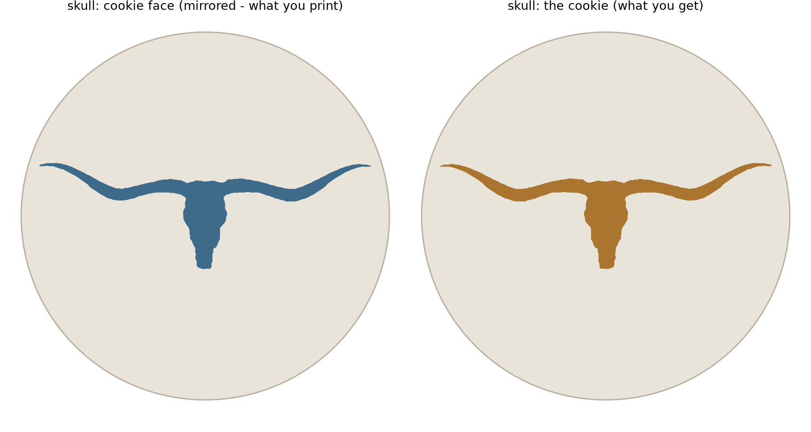
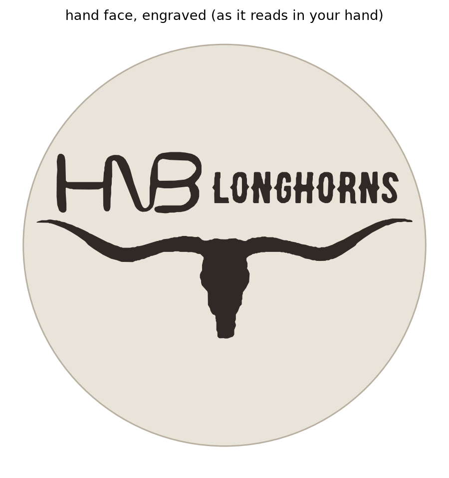

# HNB Longhorns — cookie cutter & stamp

A parametric 3D-printable cookie cutter set. The stamp is two-sided:

- **Cookie face** — the longhorn silhouette, raised, pressed into the dough.
- **Hand face** — the HNB Longhorns wordmark and skull, engraved into the side
  you hold. Never touches food.




Both pieces of artwork are traced directly from the supplied images
(`art/longhorn_source.jpg`, `art/logo_source.jpg`) rather than redrawn, so the
hand-lettered HNB and the skull come through exactly as they were given.

## Both faces are mirrored — for unrelated reasons

Worth understanding before you regenerate anything:

- The **cookie face** is mirrored because dough receives a mirror of whatever
  presses it. Standard stamp logic.
- The **hand face** is mirrored because a face is *viewed* from its own side,
  and any plane seen from behind reads backwards. Write a letter on glass, walk
  around it, and you read it in reverse.

So although the wordmark is not stamping anything, it still has to be flipped in
the model for it to read forwards in your hand. Same operation, different cause.
`preview/02_hand_face.png` shows the result as you will actually read it.

## What to print

| File | What it is | Notes |
|---|---|---|
| `stl/hnb_cutter_ring.stl` | 90 mm cutter ring | Flange down, edge up. Shared by every variant |
| `stl/hnb_stamp_<variant>.stl` | Two-sided stamp | Silhouette up, wordmark on the bed face |
| `stl/hnb_combined_<variant>.stl` | One-piece alternative | Cuts and embosses in one press. Thin dough only — see below |

### Cookie-face variants

The wordmark and the cutter ring never change; only the silhouette raised on the
cookie face does. Variants are registered in `EMBOSS_ARTWORK` in `design.py`:

| Variant | Cookie face | Source |
|---|---|---|
| `skull` | Longhorn skull and horns | `art/longhorn_source.jpg` |
| `steer` | Full-body longhorn steer | `art/steer_source.png` |

```bash
python3 hnb_cutter.py                  # every variant whose source is present
python3 hnb_cutter.py --emboss steer   # just one
```

A variant whose source image is missing is skipped with a note rather than
failing the run.

**No supports, no rotation, no brim.** Every part exports sitting on z=0 in its
print orientation, and the only unsupported surface anywhere in the set is the
engraved wordmark's ceiling, which bridges at most 10 mm.

### Why the wordmark is engraved and not raised

Because it has to be. The two faces are opposite sides of one disc, so whichever
face carries raised artwork must point up while printing. The longhorn has to be
the raised one, which puts the wordmark face on the bed — and a raised logo there
would leave the part standing on its own lettering. Flipping the part instead
would leave the whole 86 mm plate overhanging the longhorn, which no amount of
support settings makes clean.

Engraving into the bed face costs nothing: the recess is at most 10 mm across, so
it bridges trivially, and it prints in one piece with no assembly.

### Slicer settings

- **Material:** PLA. PETG if you want more durability.
- **Layer height:** 0.20 mm for the cutter. Drop to 0.12–0.16 mm for the stamp —
  the longhorn stands only 1.8 mm proud, so layer height is most of your detail.
- **Perimeters:** 3. The cutting edge tapers to 0.5 mm; any recent
  Arachne-based slicer handles that as a single variable-width extrusion.
- **Infill:** 15–20%.

### The one-piece version

Its blade and artwork rise from the same plate, so two depths are in tension:

- The blade stands **3.2 mm proud** of the longhorn (5.0 mm blade, 1.8 mm
  relief). That gap lets the edge cut clean through while the artwork only
  presses in.
- The blade also caps dough thickness. You press until it bottoms out on the
  board, leaving the plate one blade-height above it — so dough thicker than
  5 mm never gets cut through, and dough thinner than 3.2 mm never touches the
  artwork.

**Roll to about 5 mm and both work**, or move the window:

```bash
python3 hnb_cutter.py --combined-blade-height 8    # dough 6.2-8 mm
```

The two-piece set has no such constraint — cutter and stamp are independent.

## Using it

1. Roll the dough and chill it. Cold dough releases far better than warm.
2. Press the cutter through, flange up.
3. Press the stamp onto the cut round, straight down, then lift straight up.
4. Dust the stamp with flour between cookies if the dough starts clinging.

Gingerbread, shortbread and speculaas hold the detail. Anything with much
leavening will puff and swallow the imprint in the oven.

## Food safety

Layer lines can't be fully sterilised, so treat these like any printed kitchen
tool: fresh food-safe filament, hand wash cool, no dishwasher — PLA softens
around 55 °C and will warp. The tool only touches raw dough briefly, which is
the low-risk case, but it isn't a lifetime utensil.

## Changing it

```bash
pip install -r requirements.txt
python3 hnb_cutter.py                       # defaults, 90 mm
python3 hnb_cutter.py --diameter 75         # smaller cookies
python3 hnb_cutter.py --relief-height 2.2   # deeper imprint
python3 hnb_cutter.py --logo-depth 1.4      # deeper engraving
```

**Stay at 70 mm or above.** The wordmark's narrowest letters are 1.38 mm at
90 mm and shrink with the disc; under about 70 mm they fall below 1 mm, where an
engraved channel is narrower than the nozzle and the slicer fills it in.
`validate.py` warns when you cross that line.

To add or swap artwork, drop a file in `art/`, register it in `EMBOSS_ARTWORK`
and re-run. The tracer thresholds, de-speckles, smooths the pixel staircase off
the edges, and honours contour nesting so letter counters stay open.

Illustrated sources need three extra switches, which the `steer` entry shows:
`invert` for dark artwork on a light ground, `close_px` to seal the thin light
seams that panelled illustrations are carved up by, and `fill_holes` to flood
interior detailing solid. Without them a seamed drawing traces as several torn
islands instead of one silhouette.

### Checking a change

```bash
python3 validate.py --diameter 75
```

Reports narrowest stroke, widest solid, engraving bridge length, watertightness,
overhang angles separated from intended bridges, and every fit clearance.

## Files

```
hnb_cutter.py   parts, config, CLI
design.py       places the traced artwork on each face, handles both mirrors
trace.py        image -> vector outlines
geom.py         2D/3D helpers: extrude, revolve, booleans
preview.py      the renders in preview/
validate.py     print-readiness checks
art/            the source images
```
