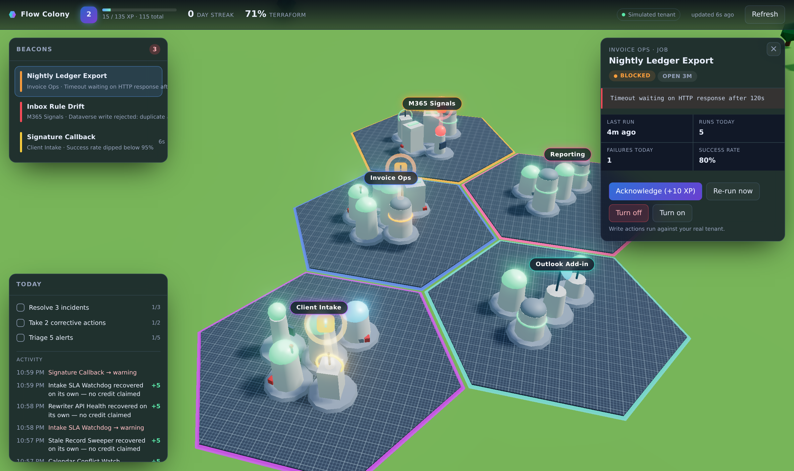

# Flow Colony

A real-time monitor for Power Automate flows and Microsoft 365 signals, rendered
as a 3D hex-tile colony. Each district is a region of your work; each building is
one monitored thing; anything that needs you plants a beacon you cannot miss.

Runs locally against your own credentials. Nothing is hosted, nothing is shared.



## Run it

```bash
cd monitor
npm install
npm start          # http://localhost:4310
```

It starts on a **simulated tenant** — 24 flows across five districts that fail,
recover and churn on a real state machine. Watch it for five minutes and you can
judge the design before dealing with any tenant admin.

```bash
npm test           # scoring rules
```

## Connecting real data

### 1. Register an app

In the [Azure portal](https://portal.azure.com) → **Entra ID** → **App registrations** → **New registration**:

1. Name it anything. Single tenant is fine.
2. Skip the redirect URI — device-code flow does not need one.
3. Under **Authentication**, enable **Allow public client flows**.
4. Under **API permissions**, add delegated permissions:
   - *Power Automate* (Microsoft Flow Service): `Flows.Read.All`, `Flows.Manage.All`
   - *Microsoft Graph*: `User.Read`, `Mail.Read`, `MailboxSettings.Read`, `Calendars.Read`
5. If your tenant requires it, click **Grant admin consent**. **This is the step
   that takes days, not minutes** — start it before you need it.
6. Copy the **Application (client) ID**.

### 2. Configure

```bash
cp .env.example .env
```

Set `AZURE_CLIENT_ID`, your `AZURE_TENANT_ID`, and turn on the providers you want:

```
ENABLE_POWER_AUTOMATE=true
ENABLE_GRAPH=true
```

### 3. Sign in

Restart and open the app. It prompts for sign-in and shows a device code — enter
it at the URL displayed. The refresh token is cached in `data/msal-cache.json`
(mode 0600). Delete that file to sign out.

## How the score works

XP is paid for **changes you caused**, never for uptime.

| Event | XP |
|---|---|
| Acknowledge an alert | +10 |
| Run a corrective action | +15 |
| Incident you attended, then recovered | +40 |
| …resolved within 10 minutes of appearing | +30 bonus |
| Incident that recovered on its own | +5, labelled "no credit claimed" |
| A flow simply being healthy | **0** |

"Flow ran successfully" is the default state of a working system. Paying for it
produces a number that only ever goes up, which everyone stops reading by week
three — so the ledger tracks interventions instead. Daily quests reset at
midnight; the streak counts days that end with nothing left untriaged.

The **terraform** percentage is a slow-moving average of overall health. It
drives the vegetation and light in the world: a neglected board goes barren, a
well-run week visibly greens up.

## Adding a data source

Write a class with two methods and register it in `server/providers/index.js`:

```js
export class MyProvider {
  id = 'mine';
  label = 'My System';

  async fetch() {
    return [ makeEntity({ id, source: 'mine', district, name, status, detail, actions }) ];
  }

  async execute(entityId, actionId) {
    return { ok: true, message: 'Done' };
  }
}
```

Normalization happens inside the provider — every API disagrees about what
"failed" means, and nothing downstream should ever see a raw payload. Valid
statuses are `healthy`, `running`, `warning`, `failed`, `blocked`, `paused`,
`unknown`; the three middle ones raise beacons.

Nothing in the renderer needs to know your source exists.

## Safety

Write actions (re-run, turn on/off) fire against your real tenant, so:

- every write requires an in-app confirmation step (`REQUIRE_CONFIRM`)
- `ALLOW_WRITE_ACTIONS=false` makes the whole app read-only
- Microsoft 365 signals are read-only regardless — mutating mail or calendar
  from a game map is a bad idea
- a drag that moves the camera is never treated as a click

## Layout

| Path | What |
|---|---|
| `server/model.js` | The normalized entity shape every provider produces |
| `server/providers/` | One file per data source |
| `server/world.js` | Hex maths and persistent building placement |
| `server/game.js` | Incidents, XP, quests, streak |
| `server/hub.js` | Poll loop, diffing, live push |
| `public/js/world.js` | The 3D scene |
| `public/js/buildings.js` | Procedural structures and beacons |
| `public/js/hud.js` | Panels, alert queue, detail card |

Building placement is persisted to `data/world.json` so a flow keeps its spot
across restarts — losing that would erase the spatial memory that makes a map
faster to read than a list. Districts grow across additional adjacent hexes as
they fill.
